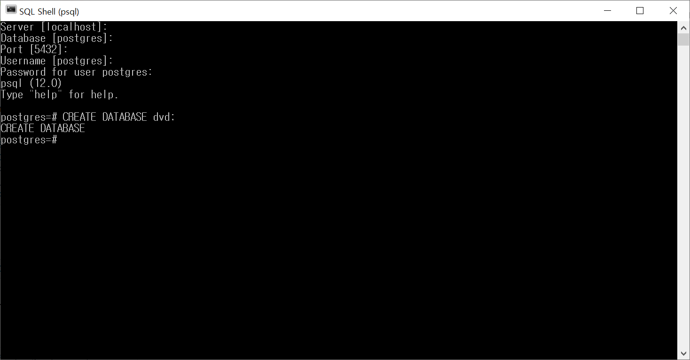
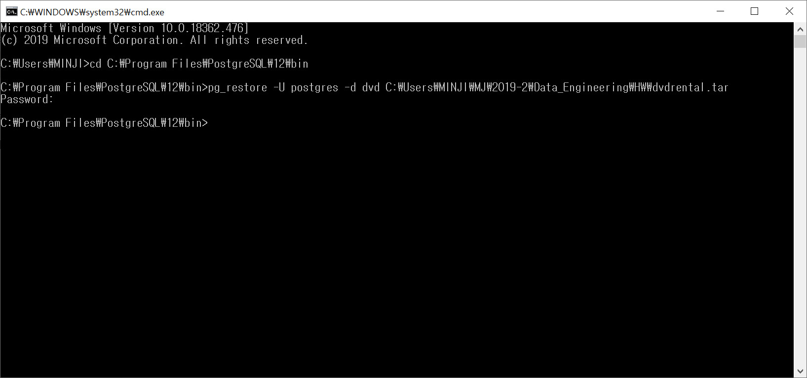
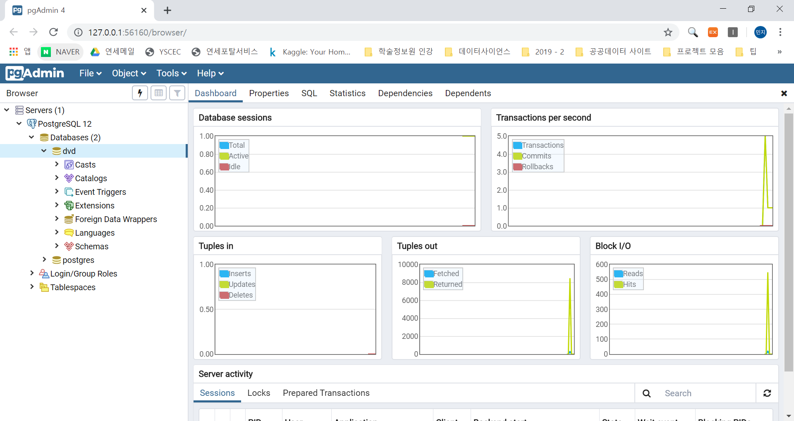

설치과정은 교수님 홈페이지를 참고하였습니다.
https://statkclee.github.io/data-science/ds-postgreSQL.html#1_postgresql_1_2

# 1. postgreSQL 설치

- 설치 디렉토리: `C:\Program Files\PostgreSQL\12`
- 포트: 5432
- 사용자명: postgres


# 2. 예제 데이터베이스 설치

## 2.1 dvd 데이터베이스 생성
- 설치 명령어 : `CREATE DATABASE dvd;`
{#id .class width="80%"}

## 2.2 dvd 데이터베이스에 데이터 추가

- 디렉토리 : `C:\Program Files\PostgreSQL\12\bin`
- 설치 명령어 : `pg_restore -U postgres -d dvd C:\Users\MINJI\MJ\2019-2\Data_Engineering\HW\dvdrental.tar`

{#id .class width="80%"}

{#id .class width="80%"}

{#id .class width="80%"}


# 3. R에서 postgreSQL 연결

- 필요한 패키지 불러오기
```{r}
#install.packages('RPostgreSQL')
#install.packages('DBI')
library(RPostgreSQL)
library(DBI)
library(tidyverse)
```


- PostgreSQL에 연결 
```{r}
pgdrv <- dbDriver("PostgreSQL")

con <- dbConnect(pgdrv, dbname="dvd", 
                 port="5432", 
                 user="postgres", 
                 password=1111, 
                 host="localhost")
```


- 사용가능한 테이블 확인 
```{r}
qry <- "SELECT *
        FROM pg_catalog.pg_tables"

dbGetQuery(con, qry) %>% 
  filter(schemaname == 'public') 
```

- 컬럼명 확인

```{r}
col_qry <- "SELECT table_name,
                   STRING_AGG(column_name, ', ') AS columns
            FROM information_schema.columns
            WHERE table_schema = 'public'
            GROUP BY table_name;"

dbGetQuery(con, col_qry) %>% 
  DT::datatable()
```


- 모든 테이블 불러오기
```{r}
category <- dbGetQuery(con, "SELECT * FROM category")
film_category <- dbGetQuery(con, "SELECT * FROM film_category")
film <- dbGetQuery(con, "SELECT * FROM film")
language <- dbGetQuery(con, "SELECT * FROM language")
inventory <- dbGetQuery(con, "SELECT * FROM inventory")
rental <- dbGetQuery(con, "SELECT * FROM rental")
payment <- dbGetQuery(con, "SELECT * FROM payment")
staff <- dbGetQuery(con, "SELECT * FROM staff")
actor <- dbGetQuery(con, "SELECT * FROM actor")
customer <- dbGetQuery(con, "SELECT * FROM customer")
address <- dbGetQuery(con, "SELECT * FROM address")
city <- dbGetQuery(con, "SELECT * FROM city")
country <- dbGetQuery(con, "SELECT * FROM country")
store <- dbGetQuery(con, "SELECT * FROM store")
```


# 4. dvd 데이터 분석 

모든 테이블을 원자료 그대로 불러와서 dplyr 패키지를 통해서 전처리하였다.

## 4.1 Q1
What are the top and least rented (in-demand) genres and what are their total sales?
(가장 많이/적게 대여된 장르는 무엇이며 그들의 총 매출액은 얼마인지 구하는 문제)

```{r}
Q1_qry <- "WITH t1 AS (SELECT c.name AS Genre, COUNT(cu.customer_id) AS Total_rent_demand
                      FROM category c
                      JOIN film_category fc
                      USING(category_id)
                      JOIN film f
                      USING(film_id)
                      JOIN inventory i
                      USING(film_id)
                      JOIN rental r
                      USING(inventory_id)
                      JOIN customer cu
                      USING(customer_id)
                      GROUP BY 1
                      ORDER BY 2 DESC),
              t2 AS (SELECT c.name AS Genre, SUM(p.amount) AS Total_sales
                      FROM category c
                      JOIN film_category fc
                      USING(category_id)
                      JOIN film f
                      USING(film_id)
                      JOIN inventory i
                      USING(film_id)
                      JOIN rental r
                      USING(inventory_id)
                      JOIN payment p
                      USING(rental_id)
                      GROUP BY 1
                      ORDER BY 2 DESC)
          SELECT t1.genre, t1.total_rent_demand, t2.total_sales
          FROM t1
          JOIN t2
          ON t1.genre = t2.genre;"

Q1 <- dbGetQuery(con, Q1_qry)

DT::datatable(Q1)
```


```{r}
t1 <- left_join(category, film_category, by='category_id') %>%
  left_join(., film, by='film_id') %>%
    left_join(., inventory, by='film_id') %>%
      left_join(., rental, by='inventory_id') %>%
        left_join(., customer, by='customer_id') %>%
          select(name, customer_id) %>%
            group_by(name) %>%
              summarize(Total_rent_demand = n())

t2 <- left_join(category, film_category, by='category_id') %>%
  left_join(., film, by='film_id') %>%
    left_join(., inventory, by='film_id') %>%
      left_join(., rental, by='inventory_id') %>%
        left_join(., payment, by='rental_id') %>%
          select(name, amount) %>%
          group_by(name) %>%
            summarize(total_sales = sum(amount, na.rm = TRUE))

left_join(t1, t2, by='name') %>%
  arrange(desc(Total_rent_demand))

```

- 분석 결과 
1) Rent A Film은 16 종류의 장르를 가지고 있다.
2) 가장 많이 대여된 장르는 Sports이며 총매출액 또한 4892.19로 가장 높다. 
3) 가장 적게 대여된 장르는 Music이며 총매출액 또한 3071.52로 가장 낮다. 


## 4.2 Q2
Can we know how many distinct users have rented each genre?

각 장르의 distinct한 고객수

```{r}
Q2_qury <- "SELECT c.name AS Genre, COUNT(DISTINCT cu.customer_id) AS Total_rent_demand_distinct
          FROM category c
          JOIN film_category fc
          USING(category_id)
          JOIN film f
          USING(film_id)
          JOIN inventory i
          USING(film_id)
          JOIN rental r
          USING(inventory_id)
          JOIN customer cu
          USING(customer_id)
          GROUP BY 1
          ORDER BY 2 DESC;"
Q2 <- dbGetQuery(con, Q2_qury)

DT::datatable(Q2)
```


```{r}
t1 <- left_join(category, film_category, by='category_id') %>%
  left_join(., film, by='film_id') %>%
    left_join(., inventory, by='film_id') %>%
      left_join(., rental, by='inventory_id') %>%
        left_join(., customer, by='customer_id') %>%
          select(name, customer_id) %>%
            group_by(name) %>%
              summarize(Total_rent_demand = n_distinct(customer_id)) %>%
  arrange(desc(Total_rent_demand))
DT::datatable(t1)
```

- 분석 결과
1번에서 Music 장르가 가장 적은 대여량을 기록했음에도 불구하고, 가장 적은 고객수를 기록하지는 않았다.
Travel 장르가 가장 적은 고객수를 기록하였다.이를 통해 알 수 있는 점은 Travel 장르의 재대여횟수가 Music 장르보다 많았다는 것이다. 
1번에서 총매출액과 대여량이 가장 많았던 Sports 장르는 고객수 또한 가장 많았다. 

## 4.3 Q3
What is the Average rental rate for each genre? (from the highest to the lowest)
각 장르의 평균대여료

```{r}
Q3_qry <- "SELECT c.name AS Genre, ROUND(AVG(f.rental_rate),2) AS Average_rental_rate
          FROM category c
          JOIN film_category fc
          USING(category_id)
          JOIN film f
          USING(film_id)
          GROUP BY 1
          ORDER BY 2 DESC;"
Q3 <- dbGetQuery(con, Q3_qry)
DT::datatable(Q3)
```

- 분석결과 

대여횟수가 각 장르의 평균대여료와 상관이 없다고 결론내릴 수 있다. 
Games 장르의 평균대여료는 가장 높지만 가장 많이 대여된 top 5 장르 중 하나이다. 
놀랍게도, Music 장르는 가장 적은 대여량을 보였으나 평균대여료가 가장 비싸지는 않다. 
Action 장르 또한 가장 많이 대여된 장르 중 하나임에도 평균대여료는 그리 비싸지 않다.  


## 4.4 Q4
How many rented films were returned late, early and on time?
반납 시기(연체/일찍/제때)에 따른 영화대여수

```{r}
Q4_qry <- "WITH t1 AS (SELECT *, DATE_PART('day', return_date - rental_date) AS date_difference
                      FROM rental),
          t2 AS (SELECT rental_duration, date_difference,
                        CASE
                          WHEN rental_duration > date_difference THEN 'Returned early'
                          WHEN rental_duration = date_difference THEN 'Returned on Time'
                          ELSE 'Returned late'
                        END AS Return_status
                  FROM film f
                  JOIN inventory i
                  USING(film_id)
                  JOIN t1
                  USING(inventory_id))
          SELECT Return_status, COUNT(*) AS total_no_of_films
          FROM t2
          GROUP BY 1
          ORDER BY 2 DESC;"
Q4 <- dbGetQuery(con, Q4_qry)
DT::datatable(Q4)
```
- 분석 결과 
The return status of movies is arguably is one the most important aspects to monitor in a DVD rental business. From the above query, 48% of the movies are returned earlier than the due date while 41% of the movies are returned late and 11% arrive on time.

There could be a number of factors for why this could be happening, like the shipping distance of these movies from stores which could be totally out of the control of the customers and so on. We would need to dive deeper into the data to get the gist of the issue.

However, it is wise to note that a significant percentage of movies are returned late. Introducing a penalty fee for late arrival could be an extra source of income and in turn, discourage late returns.

But such a decision can only make sense if we know why the issue is occurring.


## 4.5 Q5
In which countries do Rent A Film have a presence in and what is the customer base in each country? What are the total sales in each country? (From most to least)
(Rent A Film이 입점한 국가와 고객들의 국가 / 각 국가에 대한 총매출액)

```{r}
Q5_qry <- "SELECT country,
                COUNT(DISTINCT customer_id) AS customer_base,
                SUM(amount) AS total_sales
          FROM country
          JOIN city
          USING(country_id)
          JOIN address
          USING(city_id)
          JOIN customer
          USING(address_id)
          JOIN payment
          USING(customer_id)
          GROUP BY 1
          ORDER BY 2 DESC, 3 DESC;"
Q5 <- dbGetQuery(con, Q5_qry)
DT::datatable(Q5)
```

- 분석 결과 

Rent A Film has a presence in 108 countries with India having the highest customer base of 60 customers and the largest total sales in terms of money. Afghanistan has the smallest total sales in terms of money, even though it is not the only country with the smallest customer base of 1 customer


## 4.6 Q6
Who are the top 5 customers per total sales and can we get their detail just in case Rent A Film wants to reward them?
(총매출액이 가장 높은 5명의 고객을 파악하고 그들에게 보상할 때 필요한 세부 정보 파악하기)

```{r}
Q6_qry <- "WITH t1 AS (SELECT *, 
                            first_name || ' ' || last_name AS full_name
                      FROM customer)
          SELECT full_name,
                  email,
                  address,
                  phone,
                  city,
                  country,
                  SUM(amount) AS total_purchase_in_currency
          FROM t1
          JOIN address
          USING(address_id)
          JOIN city
          USING(city_id)
          JOIN country
          USING(country_id)
          JOIN payment
          USING(customer_id)
          GROUP BY 1,2,3,4,5,6
          ORDER BY 7 DESC
          LIMIT 5;"
Q6 <- dbGetQuery(con, Q6_qry)
DT::datatable(Q6)
```

- 분석 결과

Assuming we wish to reward or send physical gifts to the top customers, the above table shows their full names, addresses, email etc.

This information can be sent to the marketing team of the company in order to use their domain knowledge to decide how to reward them.


## 4.8 최종 결론 
In this project, we analyzed data from a DVD rental company we decided to call ‘Rent A Film’ to find insights about the customers and their preference. We got 3 major conclusions:

1. The company has sport-loving customers and they would be advisable to stock more sport-related films to increase total sales compared to music-related movies. It would be a good idea to increase the average rental rate of sport genre films since it is not a major factor in renting for the customers. This, in turn, increases total revenue. However further analysis needs to be done to conclude on this.

2. There is potential to have an extra source of revenue through a fee on late film returns.

3. Rent A Film has a presence in 108 countries with India been the largest market in people and revenue. Additionally, 20% of the countries they have presence in contribute to 80% of the total customer base.


## 4.7 내가 추가한 Question

```{r}
DBI::dbDisconnect(con)
```


